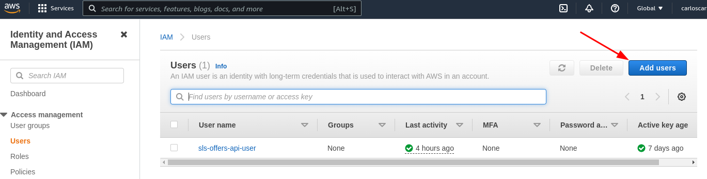
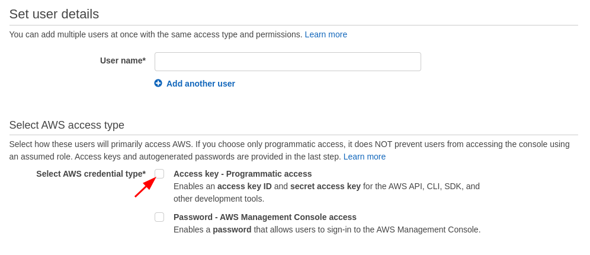
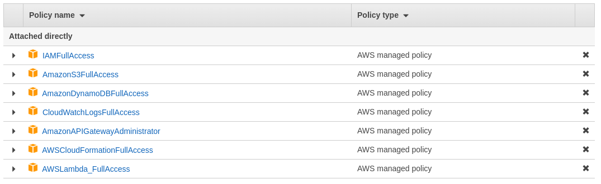
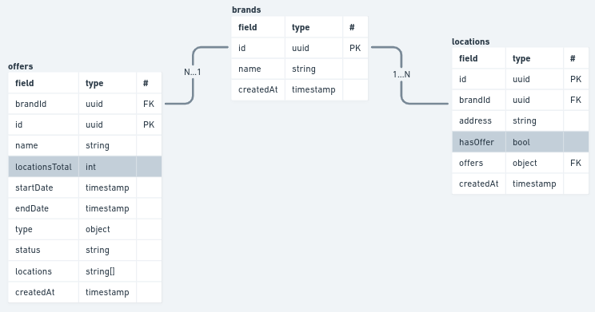
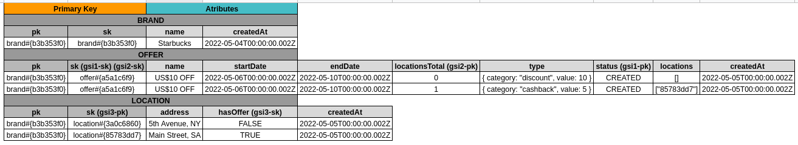

# Fidel Coding Challenge Solution

## How to run the application
### Step 1 - Create and configure a programatic user

It will be necessary to configure a programatic user for running the app.

;

;

Then, define the following policies to the user created:



At the end of this process, AWS Console will provide the credentials `ACCESS_KEY` and `SECRET_KEY`.

Using the AWS CLI, run the following on the terminal and set the keys:

```bash
aws configure
```

### Step 2 - Install Serverless Framework

```bash
npm install -g serverless
```

### Step 3 - Deploy the app

After the user has been set, the application can be deployed by using: 

```bash
serverless deploy
```

## Application Architecture
The application was designed taking in consideration Domain Driven Design concepts. So it was developed by the recommended layered architecture from the DDD book by Eric Evans.

- **Main**: Responsible for assembling the classes respecting the application contracts and adapt the app entrypoint;
- **Presentation**: Responsible for handling the request from the client and do the basic validations;
- **Application**: Responsible for applying the use cases related to each access pattern;
- **Domain**: Responsible for the business rule, the concept of each entity of the system;
- **Infrastructure**: Responsible for connecting the support tools like database and specific libraries.


## Automated Tests

> **note**: for running integration and system tests is necessary to up the containers, by the following commands:
> - At first time, move to project root and run: ```docker-compose up -d```;
> - Then, the environment can be accessed by: ```docker-compose run --rm application sh```.

Jest was the chosen tool for the automated tests. They were organized by following two concepts:

- Application's folder structure, which was, as mentioned before, inspired on DDD recommendations;
- Test Pyramid Structure, which suggests to divide the automated tests into three types:
    - **System (or End to End)** => tests the entire flow of the feature (from the input to output);
    - **Integration** => tests the comunication with external resources (such as databases and other services);
    - **Unit** => tests isolated modules (or classes) of the codebase.

Main scripts:

| command                  | description                |
|:------------------------:|:--------------------------:|
| npm test                 | runs all tests             |
| npm run test:system      | runs all system tests      |
| npm run test:integration | runs all integration tests |
| npm run test:unit        | runs all unit tests        |


## Part I
### Questions
**1. Have you ever used DynamoDb before?**

1.1 If not, how did you prepare for this task?
> Yes, I've used DynamoDB before. However, I had to study about relational data modeling on it. It's pretty tricky since traditionally we think about one different table for each entity in the domain.
> I read some docs from AWS and other sources to see how people generally do this step. I also watched some video tutorials of developers dealing with operations using Lambda and DynamoDB together. Some of the main sources that helped me were:
> - https://www.youtube.com/watch?v=Q6-qWdsa8a4&t=1181s;
> - https://aws.amazon.com/blogs/database/using-sort-keys-to-organize-data-in-amazon-dynamodb/
> - https://docs.aws.amazon.com/amazondynamodb/latest/developerguide/Expressions.UpdateExpressions.html;

1.2 If so, which patterns did you learn in the past that you used here?
> In my experience with DynamoDB I didn't have to deal with so complex data, in general I could see 2 patterns:
> - To use `PK` and `SK` with prefixes (such as "BRAND#" or "OFFER#") for making Queries using dynamodb functions (like `begins_with`);
> - Even having only one big table, to separate each entity into different repositories for performing DB actions;

**2. How did you design your data model?**

I followed 3 steps:

1. **domain modeling** :: Design the ERM (Entity Relationship Model) as if the database were relational;



2. **access patterns** :: Answer _what DynamoDB should answer about my data model?_

Some of the access patterns discovered and its possible queries:

| access pattern                | query                                                   | Indexes         |
|:-----------------------------:|:-------------------------------------------------------:|:---------------:|
| get brand                     | pk = "brand#{id}" AND sk = "brand#{id}"                 |                 |
| get offer                     | pk = "brand#{id}" AND sk = "offer#{id}"                 |                 |
| get location                  | pk = "brand#{id}" AND sk = "location#{id}"              |                 |
| get offers by status          | pk = "status" AND begins_with(sk, "offer#")             | gsi1-pk,gsi1-sk |
| get offers which has location | pk = "locationsTotal" AND begins_with(sk, offer#)       | gsi2-pk,gsi2-sk |
| get locations which has offer | pk = "hasOffer" <> false AND begins_with(sk, location#) | gsi3-pk,gsi3-sk |

3. **define table and its indexes** :: By answering the step 2 questions.



**3. What are the pros and cons of Dynamodb for an API request?**

- Pros:
  - Low latency (Speed);
  - Flexible queries by the use of indexes.

- Cons:
  - Complex data modeling for domains with many entities;


## Part II - Lambda Functions

### Questions

**1. Have you used Functions as a Service (FaaS) like AWS Lambda in the past?**

- If yes, how did this task compare to what you did?

> Yes, I used lambda before, and actually it was a similar the approach. The main difference was in the context the endpoints (or services) were pretty small, just for specific purposes, not an entire API with more than two endpoints. 

**2. What are the pros and cons of functions as a service for API requests?**

- Pros
  - Easy setup - with simple and few steps we have a great infrastructure for receiving requests, with give us some nice features (such as DDos protection);
  - Cost Reduction - a "traditional" web application, with code hosted on a server (such as Digital Ocean, Heroku or even AWS), we have to pay for the server usage regardless of whether or not the API is actually using it.

- Cons:
  - Limits - Lambda can only run for 15 minutes at max, the max memory allocated is 3GB and the maximum payload size is 256 mb. According the purpose of the system, this can be a bottleneck.


**3. How do you write operations within a concurrent architecture (parallel requests, series of async actions, async mapReduce patterns, etc.)?**

Sorry, this is something that I need to study more to talk about.

### Endpoints
| method | endpoint                  | description      | headers  | body                              |
|:------:|:-------------------------:|:----------------:|:--------:|:---------------------------------:|
| POST   | /brands                   | Adds a brand     |    -     | name                              |
| GET    | /brands/:brand_id         | Gets a brand     |    -     |                                   |
| POST   | /offers                   | Adds an offer    |    -     | brandId, name, startDate, endDate |
| GET    | /offers/:offer_id         | Gets an offer    | brandId  |                                   |
| POST   | /locations                | Adds a location  |    -     | brandId, address                  |
| GET    | /locations/:location_id   | Gets a location  | brandId  |                                   |
| PATCH  | /offers/link/:location_id | Gets a location  |    -     | brandId, offerId                  |

## Final Considerations

I'm glad to present this challenge solution. I struggled a bit with my time available for studying and coding it, but I enjoyed the time. 

I know there are several ways to improve it, but I hope this can show you some of my skills and ideas about software development.

Thank you so much for the opportunity.

See you soon.