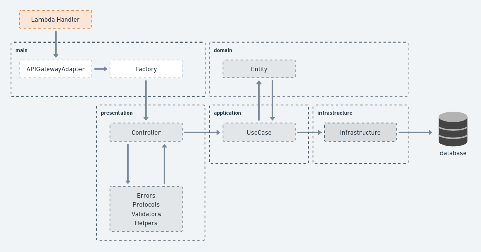

# Fidel Coding Challenge Solution

## Application Architecture
The application was designed taking in consideration Domain Driven Design concepts. So it was developed by the recommended layered architecture from the DDD book by Eric Evans.

- Presentation:
- Application:
- Domain:
- Infrastructure:

## Automated Tests
Jest was the chosen tool for the automated tests. They were organized by following two concepts:

- Application's folder structure, which was, as mentioned before, inspired on DDD recommendations;
- Test Pyramid Structure, which suggests to divide the automated tests into three types:
    - **System (or End to End)** => tests the entire flow of the feature (from the input to output);
    - **Integration** => tests the comunication with external resources (such as databases and other services);
    - **Unit** => tests isolated modules (or classes) of the codebase.

Main scripts:

| command                  | description                |
|:------------------------:|:--------------------------:|
| npm test                 | runs all tests             |
| npm run test:system      | runs all system tests      |
| npm run test:integration | runs all integration tests |
| npm run test:unit        | runs all unit tests        |

## Part I
### Questions
**1. Have you ever used DynamoDb before?**

1.1 If not, how did you prepare for this task?
> Yes, I've used DynamoDB before. However, I had to study about relational data modeling on it. It's pretty tricky since traditionally we think about one different table for each entity in the domain.
> I read some docs from AWS and other sources to see how people generally do this step. I also watched some video tutorials of developers dealing with operations using Lambda and DynamoDB together. Some of the main sources that helped me were:
> - https://www.youtube.com/watch?v=Q6-qWdsa8a4&t=1181s;
> - https://aws.amazon.com/blogs/database/using-sort-keys-to-organize-data-in-amazon-dynamodb/
> - https://docs.aws.amazon.com/amazondynamodb/latest/developerguide/Expressions.UpdateExpressions.html;

1.2 If so, which patterns did you learn in the past that you used here?
> In my experience with DynamoDB I didn't have to deal with so complex data, in general I could see 2 patterns:
> - To use `PK` and `SK` with prefixes (such as "BRAND#" or "OFFER#") for making Queries using dynamodb functions (like `begins_with`);
> - Even having only one big table, to separate each entity into different repositories for performing DB actions;

**2. How did you design your data model?**
I followed 3 steps:

1. **domain modeling** :: Design the ERM (Entity Relationship Model) as if the database were relational;
2. **access patterns** :: Answer _what DynamoDB should answer about my data model?_
3. **define table and its indexes** :: By answering the step 2 questions.

**3. What are the pros and cons of Dynamodb for an API request?**

- Pros:
  - Ease of Use for basic CRUD operations;
  - Speed;

- Cons:
  - Complex data modeling for domains with many entities;
  - Lacking of basic features (example: DynamoDB does not have INSERT method, so the developers have to be aware to not overrite data).

### Data Model

## Part II - Lambda Functions

| method | endpoint                | description      | headers  | body             |
|:------:|:-----------------------:|:----------------:|:--------:|:----------------:|
| POST   | /brands                 | Adds a brand     |    -     |                  |
| GET    | /brands/:brand_id       | Gets a brand     |    -     |                  |
| POST   | /offers                 | Adds an offer    |          |                  |
| GET    | /offers/:offer_id       | Gets an offer    |          |                  |
| POST   | /locations              | Adds a location  |          |                  |
| GET    | /locations/:location_id | Gets a location  |          |                  |

## Final Considerations
I'm glad to present this challenge solution. I hope this can show you some of my ideas about software development.